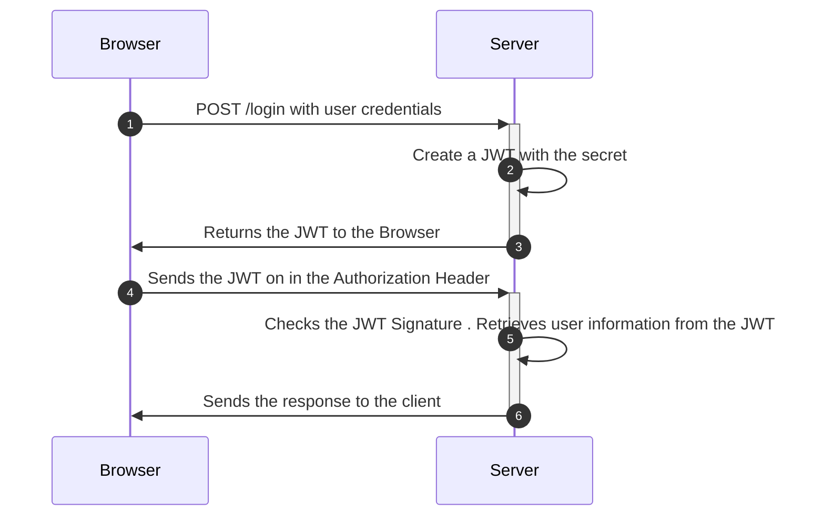
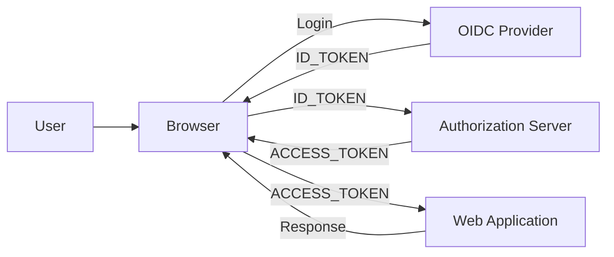

# How Is A JWT Used?

## Stateless Authorization

If you want to maintain a stateless serivice, but still need to authorize a user or services request, then you can utilize JWTs. Whether you issue the JWT directly, or rely on an OIDC Provider, everything the user and server need are present in the JWT itself. 

A user would typically send the JWT along in the request header, typically in the `Authorization: Bearer <token>`. The service where the request is being made, can validate that JWT for authenticity, check it for expiration, and then utilize any of the claims to perform a request on the user's behalf.

## Types of JWTs
In most cases, if you're using modern web technology, you'll come across two specific pre-formatted JWTs: `id_token` and `access_token`.

[tl;dr - visual edition](https://images.ctfassets.net/23aumh6u8s0i/2y2MCTq87UqQ1uzCJsl4M/c6f127f738f0d13017ff47544958d880/id-token-vs-access-token.jpg)

### ID_TOKEN
OIDC (OpenID Connect) has defined a set of [standard claims](https://openid.net/specs/openid-connect-core-1_0.html#StandardClaims), which represent metadata about a user, such as `name`, `email`, `phone_number`, `nickname`, etc. These claims can be returned either in a `UserInfo` response for an OIDC Provider, or more commonly in an `id_token` when a user authenticates through the OIDC Provider. 

The purpose of the `id_token` is to prove the user has been authenticated. This token is typically then passed on to the application proving the user is who they claim to be, and then exchanged for an `access_token`.

`id_token`s should only be used for **authentication** because they typically lack any mechanism to bind it to the client; ie: The `iss`, `aud` checks should fail in a properly configured API if provided an `id_token` for authorization.

### ACCESS_TOKEN
In the OAuth2 context, the access token allows a client application to access a specific resource to perform specific actions on behalf of the user. That is what is known as a delegated authorization scenario: the user delegates a client application to access a resource on their behalf. That means, for example, that you can authorize your LinkedIn app to access Twitter’s API on your behalf to cross-post on both social platforms. Keep in mind that you only authorize LinkedIn to publish your posts on Twitter. You don't authorize it to delete them or change your profile’s data or do other things, too. This limitation is very important in a delegated authorization scenario and is achieved through scopes. Scopes are a mechanism that allows the user to authorize a third-party application to perform only specific operations.

## TL;DR - or I Like Pictures
